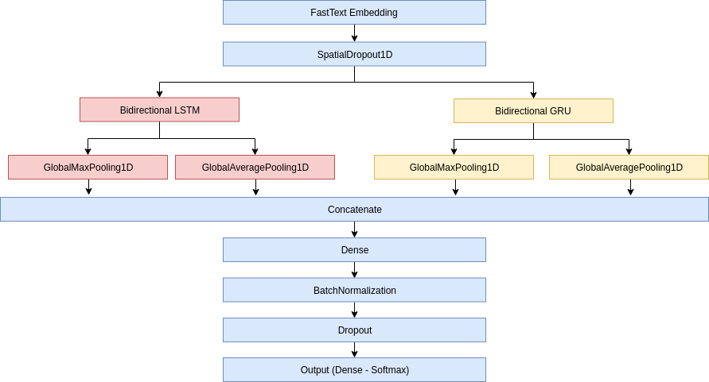

# MeLi Data Challenge 2019

### Public Leaderboard Top 1 - 0.91733

Thanks to MercadoLibre for hosting the competition, it was a good learning experience participating of this challenge. Here I will try to give an overview of my solution.

### Models
I did play a lot with diferrents models, my final result was an ensemble of a bunch of iterations that were made while I was trying new things and optimizing hyperparameters. My best single model was able to reach 0.906 on the Public Leaderboard, many other models in the ensemble are based on this one:



My general strategy for this competition was to divide the dataset in two, one for each language (spanish and portuguese), so each model was tranied twice for each language

### Embedding
I was surprised when my own FastText embedding trained on the competition dataset was performing better than pretrained ones on larger datasets. I suppose that the competition dataset was large enough for a self-trained embedding outperform generic ones.
For the text preprocessing I tried to normalize the data the best I could without removing too much information, one successful tatic was not to remove numerical values, but normalize then to the same representation.

Example of the tranined embedding:
```python
#'amd' + 'i7' - 'intel' = 'ryzen'
>> model.wv.most_similar_cosmul(positive=['amd', 'i0'], negative=['intel'], topn=3)
[('core_i0', 0.8729642033576965),
 ('amd_ryzen', 0.8678964972496033),
 ('ryzen', 0.862457275390625)]
```

### How to train the models, step by step:

```bash
#Install requirements
pip install -r requirements.txt

#Donwload dataset to ./data folder
cd data
wget https://meli-data-challenge.s3.amazonaws.com/train.csv.gz
wget https://meli-data-challenge.s3.amazonaws.com/test.csv
gunzip train.csv.gz
cd ..

#Preprocess train and test data
python preprocessing.py

#Train FastText embedding on the preprocessed corpus
python embedding.py

#Vectorize the text corpus into a sequence of integers for the embedding layer of each deep learning model
python tokenizer.py

#Train all models used for the final inference (list on ./models folder)
python train.py --all

#Ensemble the results of all models and generate the submission file (./data/submission.csv)
python ensemble.py

```

MercadoLibre Data Challenge 2019
